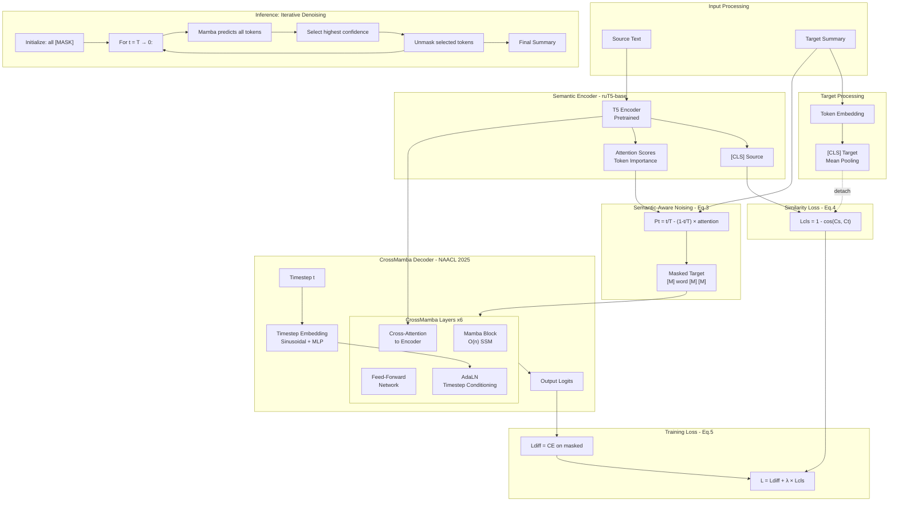

# Masked Diffusion Language Model for Russian Text Summarization

This project implements a **Masked Diffusion Language Model** for abstractive text summarization in Russian, based on approaches from:

- **Discrete Diffusion Language Model for Summarization** (NAACL 2025)
- **LLaDA**: Large Language Diffusion Models (Nie et al., 2025)
- **Arg-LLaDA**: Argument Summarization via Large Language Diffusion Models

## Architecture

Unlike traditional autoregressive models that generate text token-by-token, this model uses an **iterative denoising approach** with **semantic-aware noising**.

### Architecture Diagram



### Key Components (from NAACL 2025 paper)

1. **Semantic Encoder (ruT5-base)**
   - Encodes source text into hidden representations
   - Computes [CLS] token for similarity loss
   - Extracts attention scores for semantic-aware noising

2. **Semantic-Aware Noising** (Eq. 3)
   - Important tokens (high attention) → lower mask probability
   - Important words generated **first** during inference
   - Formula: `Pt = t/T - (1 - t/T) * attention_score`

3. **Similarity Loss** (Eq. 4)
   - Aligns source and target semantic representations
   - Formula: `Lcls = 1 - cos(source_cls, target_cls)`
   - Target is **detached** to avoid trivial solutions

4. **CrossMamba Decoder** (from NAACL 2025)
   - **Mamba blocks**: State Space Model with O(n) complexity
   - **Cross-attention**: Conditions on encoder outputs
   - **AdaLN**: Timestep conditioning via scale and shift
   - Fallback to Transformer if `mamba-ssm` not installed

### Mamba vs Transformer Decoder

| Aspect | Mamba (CrossMamba) | Transformer |
|--------|-------------------|-------------|
| Complexity | O(n) | O(n²) |
| Long sequences | Efficient | Memory-heavy |
| Parallelization | Sequential scan | Fully parallel |
| Requirement | CUDA + mamba-ssm | None |

### Training vs Inference

| Aspect | Training | Inference |
|--------|----------|-----------|
| Input | Target with semantic-aware masking | Fully masked sequence |
| Process | Single forward pass | Iterative (T steps) |
| Output | Loss (diffusion + similarity) | Generated summary |
| Token selection | Based on source attention | Highest confidence first |

## Dataset

Training uses [RussianNLP/Mixed-Summarization-Dataset](https://huggingface.co/datasets/RussianNLP/Mixed-Summarization-Dataset):
- ~198K training examples
- 258 test examples
- Mixed sources: news, dialogues, articles

## Requirements

### Model Size
- **Parameters:** ~280M (ruT5-base encoder + CrossMamba decoder)
- **Memory:** ~5-6 GB (fp16) / ~8-9 GB (fp32)

## Installation

```bash
# Clone repository
git clone <repository-url>
cd Final_qualification_work

# Create virtual environment
python -m venv venv
source venv/bin/activate  # Linux/Mac
# or
.\venv\Scripts\activate  # Windows

# Install dependencies
pip install -e .
# or with uv
uv pip install -e .

# Optional: Install Mamba for GPU (requires CUDA)
pip install mamba-ssm causal-conv1d
```

### Google Colab

```python
!pip install torch transformers accelerate datasets pyyaml tqdm rouge-score sentencepiece protobuf python-dotenv comet-ml

# Optional: Mamba for faster training
!pip install mamba-ssm causal-conv1d
```

## Configuration

1. Copy environment template:
```bash
cp .env.example .env
```

2. Add your CometML API key to `.env`:
```
COMET_API_KEY=your_api_key_here
COMET_PROJECT_NAME=diffusion-summarization
COMET_WORKSPACE=your_workspace
```

3. Review and modify `config/train_config.yaml` as needed.

## Quick Test (CPU)

Before running full training, verify everything works on CPU:

```bash
# Test forward/backward pass on 1 batch
python test_single_batch.py

# Or run training loop on 1 batch
python train.py --config config/one_batch_test.yaml
```

This uses reduced model size and fallback Mamba implementation for CPU compatibility.

## Training

### Single GPU

```bash
python train.py --config config/train_config.yaml
```

### Distributed Training (Multiple GPUs)

```bash
# First, configure accelerate
accelerate config

# Then run training
accelerate launch train.py --config config/train_config.yaml
```

### Resume from Checkpoint

```bash
python train.py --config config/train_config.yaml --resume checkpoints/checkpoint_epoch1_step5000
```

### Training on Cluster (SLURM)

Example SLURM script:

```bash
#!/bin/bash
#SBATCH --job-name=diffusion-sum
#SBATCH --nodes=1
#SBATCH --gpus-per-node=4
#SBATCH --time=48:00:00

source venv/bin/activate
accelerate launch --num_processes=4 train.py --config config/train_config.yaml
```

## Evaluation

```bash
# Full evaluation with BERTScore
python evaluate.py --model_path checkpoints/best_model --output results.json

# Fast evaluation (ROUGE only)
python evaluate.py --model_path checkpoints/best_model --no_bertscore
```

## Generation

```bash
# Single text
python generate.py --model_path checkpoints/best_model --text "Ваш текст для суммаризации..."

# From file
python generate.py --model_path checkpoints/best_model --input_file texts.txt --output_file summaries.txt
```

## Project Structure

```
.
├── config/
│   ├── train_config.yaml      # Training configuration
│   └── one_batch_test.yaml    # Quick test configuration (1 batch, CPU)
├── src/
│   ├── model/
│   │   ├── diffusion_model.py # Masked Diffusion model
│   │   ├── mamba_decoder.py   # CrossMamba decoder (with fallback)
│   │   └── noise_scheduler.py # Noise scheduling
│   ├── data/
│   │   └── dataset.py         # Dataset loading
│   └── utils/
│       ├── logging_utils.py   # CometML integration
│       └── metrics.py         # ROUGE, BERTScore
├── train.py                   # Training script
├── evaluate.py                # Evaluation script
├── generate.py                # Generation script
├── test_single_batch.py       # Quick test on 1 batch (CPU)
├── pyproject.toml             # Dependencies
└── README.md
```

## Hyperparameters

Key hyperparameters in `config/train_config.yaml`:

| Parameter | Default | Description |
|-----------|---------|-------------|
| `model.encoder` | `ai-forever/ruT5-base` | Pretrained encoder |
| `model.num_diffusion_steps` | 20 | Denoising steps |
| `model.decoder_type` | `mamba` | Decoder type (mamba/transformer) |
| `training.batch_size` | 8 | Per-device batch size |
| `training.learning_rate` | 5e-5 | Learning rate |
| `training.num_epochs` | 10 | Number of epochs |
| `training.mixed_precision` | `fp16` | Mixed precision (fp16/bf16/no) |
| `data.max_source_length` | 512 | Max source tokens |
| `data.max_target_length` | 128 | Max target tokens |

### Configuration for Limited GPU Memory

If you have less than 16 GB VRAM, adjust these settings:

```yaml
training:
  batch_size: 2                    # Reduce batch size
  gradient_accumulation_steps: 16  # Keep effective batch = 32
  mixed_precision: "fp16"          # Enable fp16
```

## Metrics

The model is evaluated using:

- **ROUGE-1/2/L**: N-gram overlap with reference
- **BERTScore**: Semantic similarity using RuBERT

## License

MIT License

## References

```bibtex
@article{nie2025llada,
  title={Large Language Diffusion Models},
  author={Nie, Shen and others},
  journal={arXiv preprint arXiv:2502.09992},
  year={2025}
}

@article{li2025argllada,
  title={Arg-LLaDA: Argument Summarization via Large Language Diffusion Models},
  author={Li, Hao and others},
  journal={arXiv preprint arXiv:2507.19081},
  year={2025}
}
```
