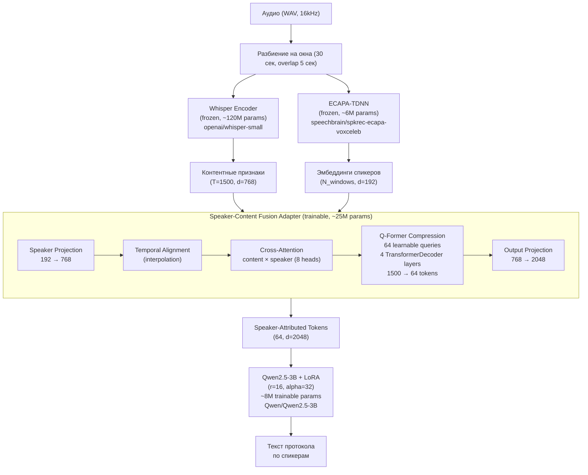
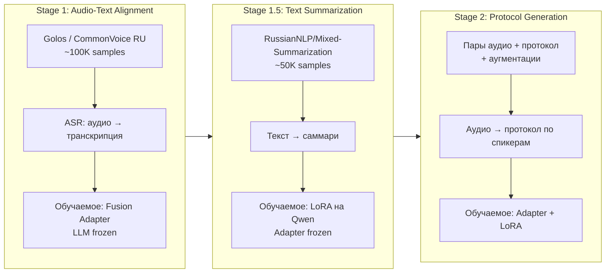

# SpeechProtocol: End-to-End Audio → Meeting Protocol

Мультимодальная архитектура для генерации протоколов встреч из аудио.
Заменяет пятиэтапный пайплайн (диаризация → ASR → коррекция → суммаризация → кластеризация)
единой end-to-end моделью.

## Архитектура



### Сводка параметров

| Компонент | Модель | Параметры | Обучаемые |
|-----------|--------|-----------|-----------|
| Audio Encoder | `openai/whisper-small` | ~120M | 0 (frozen) |
| Speaker Encoder | `speechbrain/spkrec-ecapa-voxceleb` | ~6M | 0 (frozen) |
| Fusion Adapter | Custom (Q-Former) | ~25M | ~25M |
| LLM Decoder | `Qwen/Qwen2.5-3B` + LoRA | ~3B | ~8M (LoRA) |
| **Итого** | | **~3.15B** | **~33M (1.05%)** |

## Опорные работы

| Статья | Год | Ключевая идея | Ссылка |
|--------|-----|---------------|--------|
| **SpeakerLM**: End-to-End Versatile Speaker Diarization and Recognition with Multimodal Large Language Models | AAAI 2025 | Единая MLLM для совместной диаризации и ASR через audio encoder + projector + LLM | [arXiv:2508.06372](https://arxiv.org/abs/2508.06372) |
| **SALMONN**: Towards Generic Hearing Abilities for Large Language Models | 2024 | Двойной аудио-энкодер (Whisper + BEATs), Q-Former адаптер, LLM-декодер | [arXiv:2310.13289](https://arxiv.org/abs/2310.13289) |
| **Qwen2-Audio**: A Large-Scale Audio-Language Model | 2024 | Whisper-large-v3 энкодер + Qwen-7B, трёхэтапное обучение | [arXiv:2407.10759](https://arxiv.org/abs/2407.10759) |
| **FastSLM**: Hierarchical Frame Q-Former for Effective Speech Modality Adaptation | 2025 | Иерархический Q-Former для сжатия аудио-токенов до 1.67 ток/сек | [arXiv:2601.06199](https://arxiv.org/abs/2601.06199) |
| **DiariST**: Streaming Speech Translation with Speaker Diarization | 2024 | Совместная диаризация и перевод речи на базе Whisper | [IEEE Xplore](https://ieeexplore.ieee.org/document/10446050/) |
| **UME**: Unified Multi-Speaker Encoder | 2025 | Общий энкодер для диаризации, разделения и multi-speaker ASR | [arXiv:2508.20474](https://arxiv.org/abs/2508.20474) |

## Стратегия обучения



### Запуск обучения

```bash
# Stage 1: Audio-text alignment (ASR)
python -m training.train --stage 1

# Stage 1.5: Text summarization (LoRA only, no audio)
python -m training.train --stage 1.5

# Stage 2: Protocol generation (adapter + LoRA, end-to-end)
python -m training.train --stage 2

# Возобновление с чекпоинта
python -m training.train --stage 2 --resume checkpoints/stage2/step_1000
```

### Данные

| Стадия | Датасет | Объём | Источник |
|--------|---------|-------|----------|
| Stage 1 | Golos (farfield) | ~100K сэмплов | [SberDevices/Golos](https://huggingface.co/datasets/SberDevices/Golos) |
| Stage 1.5 | Mixed-Summarization | ~198K сэмплов | [RussianNLP/Mixed-Summarization-Dataset](https://huggingface.co/datasets/RussianNLP/Mixed-Summarization-Dataset) |
| Stage 2 | Собственный датасет | 500–2000 пар | `data/protocols/` (audio.wav + protocol.txt) |

### Аугментации

- **Аудио**: Gaussian noise, pitch shift, time stretch, gain perturbation (audiomentations)
- **SpecAugment**: Частотное и временное маскирование мел-спектрограмм
- **Спикерные**: Перемешивание speaker ID в протоколе
- **Текстовые**: Парафраз, изменение детализации

### Оборудование

- NVIDIA V100 32GB
- ~21–25 GB VRAM при обучении (fp16 + gradient checkpointing)

## Инференс

```bash
python -m inference.generate \
    --audio path/to/meeting.wav \
    --checkpoint checkpoints/stage2/best \
    --output protocol.txt
```

Поддерживается длинное аудио (>30 сек) через chunking с overlap.

## Оценка

```bash
python -m evaluation.evaluate \
    --checkpoint checkpoints/stage2/best \
    --test-data data/protocols_test
```

Метрики: ROUGE-1/2/L, BERTScore (ruBERT), Speaker Attribution Accuracy, время инференса.

## Логирование

CometML — ключ и проект в `.env`:

```
COMET_API_KEY=...
COMET_PROJECT_NAME=speech-protocol
```

## Структура проекта

```
├── model/
│   ├── config.py                  # ModelConfig dataclass
│   ├── audio_encoder.py           # Whisper encoder wrapper
│   ├── speaker_encoder.py         # ECAPA-TDNN wrapper
│   ├── fusion_adapter.py          # Speaker-Content Fusion + Q-Former
│   └── speech_protocol_model.py   # Full model with LoRA
├── training/
│   ├── augmentations.py           # Audio/text/SpecAugment
│   ├── dataset.py                 # ASR/Summarization/Protocol datasets
│   ├── collator.py                # Batch padding
│   ├── train_config.yaml          # Hyperparameters
│   └── train.py                   # Training script (all stages)
├── inference/
│   └── generate.py                # Audio → protocol text
├── evaluation/
│   ├── metrics.py                 # ROUGE, BERTScore, Speaker Accuracy
│   └── evaluate.py                # Evaluation script
```
